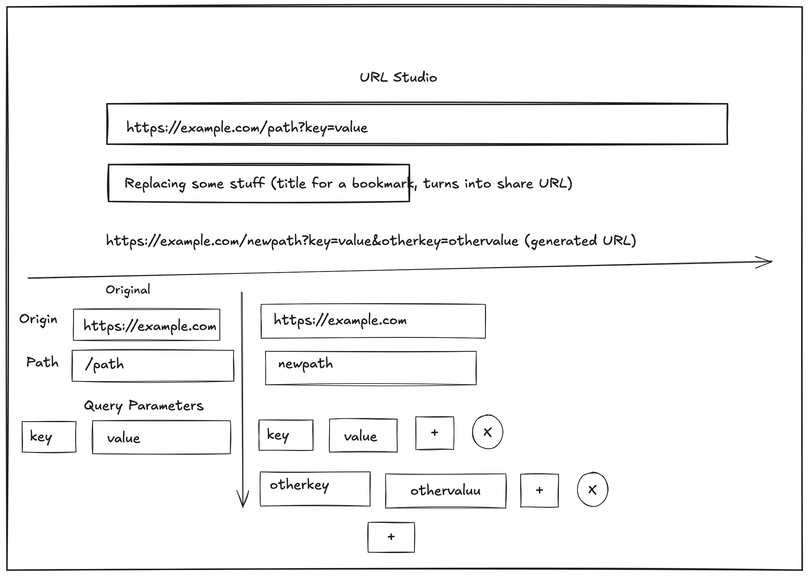

Ok, I'd like to create a URL editor, where you paste a URL in, and it builds a form to edit the URL and the query parameters. Here's a quick mockup of what it should look like:



Some notes about this (not that I'm referring to the URL of the form as the "app URL", distinct from the URL the user pastes in, which I'll call the "user URL")

- When the user updates anhything form, the app's URL should live update. The idea is that when the user copies the app URL and pastes it into another browser window, they don't lose any progress in their form updates
- The title for the bookmark just updates the app's URL to have a query parameter `t=the users title the put in the bookmark field "replacing some stuff" in the picture`. It should be query escaped
- The stuff on the left of the split below should be read only, and the stuff on the right is how the user modifies the URL generated above the fold. As stated above, changes to these modify the app URL
- The CSS should not be too flashy. I'm thinking bamboo.css, though I'm open to other suggestions.

Code style:

- No dependencies!! We're going to host jsut these static files. We're going to vendor our CSS (so we need small framework)
- No compilation!
- tests should run built in node test runner
- lib.js shoudl be complety typed with JSDoc comments so VS code catches errors
- Try to separate I/o (dom updates) from computation so we can keep it easy to test and reason about.

Structure:

```
index.html
lib.js # holds pure functions that we can test. Most of the logic in here
lib.test.js # runs with built-in node test runner, tests for lib.js
index.js # imports lib.js and does dom updates. Should be small
???.css # a small CSS library
```

Other:

- Since you're running in VS Code , use the local browser to test functionality.

Please review this plan and ask any questions. Once I give the go-ahead, start implementing.
